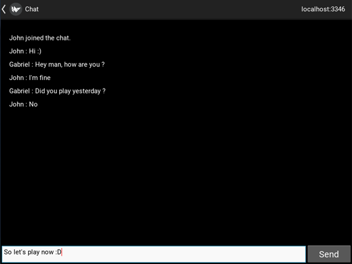

# Description:

Do you want to chat quickly with your friends without having to create an account, in an easy and practical way ? 
So, how about using this amazing chat ? With it, you can create a server and chat with your friends via the internet or LAN.

# Requirements:

**This application was created on Kivy using version 1.11.1. To install Kivy,
click [here](https://kivy.org/doc/stable/installation/installation-windows.html) and follow 
the instructions.**

- Kivy
- Pygame

# How to use it ?

**Creating a server:**
- Enter your username.
- Enter the server's IP address and port number.
- Press the `Create Server` button.

**Connecting to the server:**
- Enter your username.
- Enter the server's IP address and port number.
- Press the `Connect` button.
